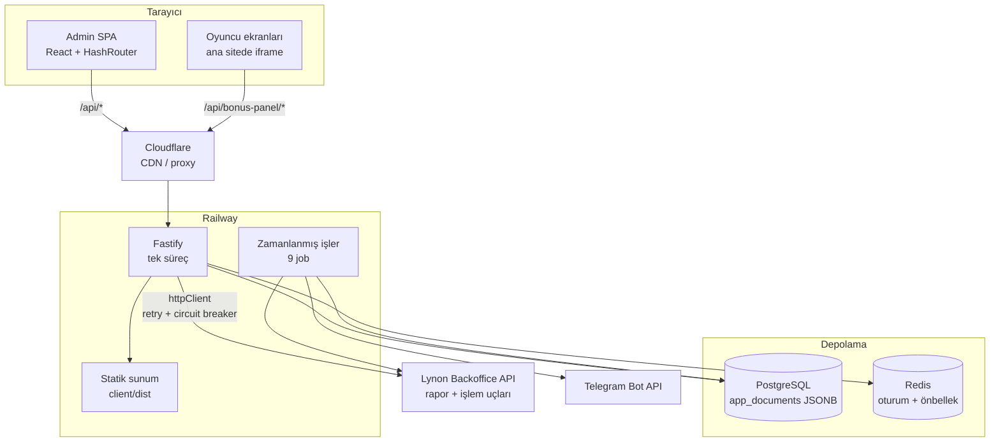

# Bugs Panel

Çok kiracılı (multi-tenant) backoffice ve oyuncu etkileşim paneli. Lynon / BetConstruct
ailesi bir bahis platformunun üzerine oturur; operasyon ekibinin platformun kendi
arayüzünde yapamadığı işleri yapar ve oyunculara platformun sunmadığı etkileşim
ekranlarını açar.

```
İşletmeci  ──►  Bugs Panel  ──►  Lynon Backoffice API
Oyuncu     ──►  (iframe)    ──►  PostgreSQL / Redis
```

---

## İçindekiler

1. [Amaç ve Temel Özellikler](#1-amaç-ve-temel-özellikler)
2. [Teknoloji Yığını](#2-teknoloji-yığını)
3. [Sistem Mimarisi ve Veri Akışı](#3-sistem-mimarisi-ve-veri-akışı)
4. [Çekirdek Modüller ve Dosya Yapısı](#4-çekirdek-modüller-ve-dosya-yapısı)
5. [Yol Haritası](#5-yol-haritası)
6. [Kurulum](#kurulum)

---

## 1. Amaç ve Temel Özellikler

### Çözdüğü problem

Lynon backoffice'i bir bahis sitesini **işletmek** için gerekli her şeyi vermiyor:
raporları ham ve dağınık sunuyor, çekim onayı için kural motoru içermiyor, oyuncuya
dönük hiçbir etkileşim yüzeyi yok ve tek bir markaya kilitli. Bu panel araya girip
üç boşluğu birden kapatıyor:

| Boşluk | Panelin cevabı |
|---|---|
| Çekim taleplerinin elle denetimi yavaş ve tutarsız | Kural motoru + risk analizi + otomatik çekim işi |
| Raporlar dağınık, aynı sayı farklı yerde farklı çıkıyor | Tek kaynaktan türetilen pano, mutabakat ve denetim raporları |
| Oyuncuya dönük kampanya yüzeyi yok | Ana siteye iframe olarak gömülen lobi, çark, turnuva, görev ekranları |
| Her marka için ayrı kurulum gerekiyor | Tek sürüm, çok kiracı; site başına kimlik ve kural |

### Temel özellikler

**Finans ve çekim**

- Çekim talebi değerlendirme motoru: promosyon çevrim şartı, bonus kuralı, aynı-IP
  kontrolü, ters bahis (opposite betting) tespiti, davranış kategorisi
- Otomatik çekim işi — kurallardan geçen talepleri operatörsüz onaylar
- Yatırım/çekim listeleri, işlem anomali tespiti, yöntem komisyonu hesabı
- Mutabakat: panelin gördüğü ile backoffice'in gördüğü rakamların karşılaştırılması
- Manuel düzeltme (correction) raporu ve denetim kaydı

**Raporlama ve analiz**

- Pano: KPI kartları, GGR dağılımı, ciro/net kazanç karşılaştırması, oyun türü kırılımı
- En çok oynanan kasino oyunları ve spor branşları
- Sağlayıcı raporu, kayıt istatistikleri, tüm bonus raporu, işlem listesi
- Oyuncu profili: KPI, bahis geçmişi, bonus geçmişi, notlar, churn skoru
- Canlı radar, risk analizi, otomatik oyuncu kategorileme

**Bonus ve sadakat**

- Bonus kural editörü (`RulesManager`), bonus kara listesi, otomatik bonus
- Ertesi gün bonusu, hedef bakiye, kayıp tabanı (cashback) hesabı
- Sadakat/VIP seviyeleri, günlük görevler, turnuva puanlama

**Oyuncu etkileşimi** (ana siteye iframe olarak gömülür)

- Lobi, bonus talep formu, şans çarkı, kazı-kazan, skor tahmin
- Yazı-tura, taş-kağıt-makas, milyonerler vitrini, günlük görevler
- Günlük / haftalık / aylık turnuva, sadakat merkezi, VIP sayfası, ortaklık

**Yönetim**

- Rol ve izin bazlı personel sistemi (`admin` / `operator` + izin anahtarları)
- Master paneli: siteleri ekleme, kimlik bilgilerini şifreli saklama
- Telegram entegrasyonu: bonus hakkı, çekim eylemi, günlük rapor botu
- CRM köprüsü, affiliate takibi, iframe gömme kodu üreteci

---

## 2. Teknoloji Yığını

### Sunucu (`server/`)

| Katman | Seçim | Not |
|---|---|---|
| Çalışma ortamı | Node.js ≥ 20, TypeScript 5.6, ESM | `"type": "module"` |
| HTTP | Fastify 4 | `trustProxy`, 15 MB gövde limiti |
| Güvenlik | `@fastify/helmet`, `@fastify/rate-limit`, `@fastify/cors` | CSP istek başına üretilir |
| Oturum | `@fastify/session` + `@fastify/cookie` | Redis store; üretimde zorunlu |
| Veritabanı | PostgreSQL (`pg` havuzu) | Belge deposu deseni, JSONB |
| Önbellek | Redis (`redis`) | Oturum + uygulama önbelleği |
| Şifre | `bcryptjs` | Personel parolaları |
| Dokümantasyon | `@fastify/swagger` + Swagger UI | `/docs`, üretimde kapalı |
| Test | Vitest 4 | 90 test dosyası / 1341 test |

### İstemci (`client/`)

| Katman | Seçim | Not |
|---|---|---|
| Çatı | React 18 + Vite 5 + TypeScript | `@/*` → `src/*` yol takma adı |
| Yönlendirme | `react-router-dom` 7, **HashRouter** | Bilinçli tercih — [neden](#neden-hashrouter) |
| Sunucu durumu | TanStack Query 5 | `staleTime: 60s`, `retry: 1` |
| İstemci durumu | Zustand | UI durumu ve bildirimler |
| Stil | Tailwind CSS 3 + `@layer components` | "Premium Dark Glassmorphism" |
| Bileşen | Radix UI (dialog, select, tabs, dropdown) | Erişilebilir ilkeller |
| Grafik | Recharts 3 | Pano grafikleri |
| Animasyon | Framer Motion 11 | Sayfa geçişi CSS keyframe ile |
| Form | React Hook Form + Zod | `@hookform/resolvers` |
| Test | Vitest 2 + Testing Library | 121 test |

### Altyapı

- **Docker** çok aşamalı imaj (istemci derlenir, sunucu onu statik servis eder)
- **Railway** barındırma, **Cloudflare** önünde CDN/proxy
- **GitHub Actions**: `dagitim.yml` (`main` → `railway up`), `testler.yml`, `imaj-derleme.yml`

---

## 3. Sistem Mimarisi ve Veri Akışı

### Genel görünüm



### Bir isteğin yaşam döngüsü

```
1. Tarayıcı            GET /api/dashboard/summary?startDate=…
2. Cloudflare          /api altı önbelleğe ALINMAZ (no-store + Vary: Cookie)
3. Fastify onSend      Cache-Control/Pragma/Expires/Vary başlıkları yazılır
4. preHandler: tenant  Oturum > master ?tenantId > Host eşleşmesi ile kiracı çözülür
                       AsyncLocalStorage bağlamı açılır (runWithTenant)
5. authGuard           Oturum ve izin kontrolü
6. Rota                routes/dashboard.ts
7. Servis              lynonBackofficeService — önbellek anahtarı: tenant+aralık+kur
8. Yukarı akış         lynonAuth oturumu (çerez kavanozu + OTP) → Lynon REST
9. Dönüşüm             Ham rapor satırları panelin modeline çevrilir
10. Yanıt              JSON; TanStack Query istemcide 60 sn taze tutar
```

### Çok kiracılılık — mimarideki asıl karar

`lynonBackofficeService.ts` 4267 satır ve içindeki doksanı aşkın çağrı yapılandırmayı
**senkron** okuyor. Bu fonksiyonların hepsine `tenantKey` parametresi eklemek,
çağıran her rotayı ve her testi dokunulmuş hale getiren, incelenemez bir yama olurdu.

Bunun yerine kiracı, isteğin **yürütme bağlamında** taşınıyor:

```ts
// app.ts — tek kanca
app.addHook('preHandler', (request, _reply, done) => {
  if (!request.url?.startsWith('/api')) return done();
  resolveTenantKeyForRequest(request)
    .then((key) => runWithTenant(key, () => done()));   // done() bağlamın İÇİNDE
});
```

`AsyncLocalStorage` sayesinde altındaki tüm eşzamansız zincir `currentTenantKey()`
ile aynı cevabı okuyor. Kanca `async` yazılsaydı bağlam kanca döner dönmez kapanır ve
işleyici varsayılan kiracıya düşerdi — bu ayrıntı kodda ayrıca not edilmiş durumda.

Arka plan işlerinin istek bağlamı yok; bu yüzden açılışta `hydrateTenantRuntime()`
bütün site yapılandırmalarını belleğe alıyor ve her iş kendi döngüsünü
`runWithTenant` ile sarıyor.

### Depolama deseni

İlişkisel şema **yok**. Tek bir belge tablosu var:

```sql
CREATE TABLE app_documents (
  tenant_key TEXT NOT NULL,
  namespace  TEXT NOT NULL,
  payload    JSONB NOT NULL DEFAULT '{}'::jsonb,
  version    BIGINT NOT NULL DEFAULT 1,
  created_at TIMESTAMPTZ NOT NULL DEFAULT NOW(),
  updated_at TIMESTAMPTZ NOT NULL DEFAULT NOW()
)
```

`documentStore.ts` üç davranışı birden veriyor:

- Veritabanı hazırsa oradan okur
- Kayıt yoksa JSON dosyasından **taşır** ve veritabanına yazar (tek yönlü geçiş)
- Veritabanı hiç yoksa (geliştirme) atomik dosya yazımına düşer

İşletme verisi (oyuncu, bahis, işlem) **panelde tutulmuyor** — kaynak Lynon.
Panelin veritabanı yalnızca panelin kendi durumunu taşıyor: kurallar, ayarlar,
personel, denetim kaydı, kiracı kimlikleri.

### Güvenlik sınırları

**iframe gömme.** Panel ana sitede iframe olarak çalışıyor ve ana sitenin adresi
düzenli olarak dönüyor (`narcosbahis484.com` → `485` → …). CSP `frame-ancestors`
alan adının **ortasında** joker kabul etmiyor, dolayısıyla bu statik yazılamıyor.
Üç mod var:

| Ortam değişkeni | Davranış | Ne zaman |
|---|---|---|
| `FRAME_ANCESTORS` | Sabit liste | Adres dönmüyorsa |
| `FRAME_ANCESTOR_RANGE` | `https://narcosbahis{480-560}.com` açılışta açılır | **CDN arkasında önerilen** |
| `FRAME_ANCESTOR_PATTERNS` | Joker; direktif istek başına üretilir | CDN yoksa |

`RANGE` tercih ediliyor çünkü liste her istekte **aynı** kalıyor ve önbelleğe
alınması zararsız. `PATTERNS` yanıtı istek başına değiştiriyor; Cloudflare
`Accept-Encoding` dışındaki `Vary` değerlerini yok saydığı için (ölçüldü) önbellekteki
kopya onu ilk dolduran isteğin listesini taşıyor ve düzeltme aralıklı olarak geri
alınıyor. Ayrıntı ve güvenlik gerekçesi: [`lib/cerceveAtaslari.ts`](server/src/lib/cerceveAtaslari.ts).

**Çerez.** Gömülü çalışırken istekler tarayıcı için "cross-site"; `SameSite=Lax`
çerez hiç gönderilmez. Gömme açıkken varsayılan `SameSite=None; Secure` ve —
Chrome üçüncü taraf çerezleri engellediğinde çalışsın diye — `Partitioned` (CHIPS).

**API önbelleği.** `/api` altındaki **her** yanıt `no-store` alıyor. Tek tek uçları
işaretlemek yerine toptan kapatıldı: `/api/bonus-panel/me` gibi bir uç kimlik
döndürüyor ve önbelleğe alındığında bir oyuncu başkasının kullanıcı adıyla
doğrulanmış görünüyordu (üretimde `cf-cache-status: EXPIRED` ile doğrulandı).

**CSP.** `scriptSrc` içinde `'unsafe-inline'` **yok**. Panelde admin tarafından
girilen HTML üç yerde ham render ediliyor; açık bırakılsa o alanlara yazılan
`<script>` çalışırdı.

---

## 4. Çekirdek Modüller ve Dosya Yapısı

```
.
├── client/                 Admin + oyuncu SPA (React)
├── server/                 API, iş mantığı, statik sunum (Fastify)
├── affiliate-panel/        AYRI ürün — kendi sunucusu, arayüzü, veritabanı
├── docs/LYNON_ENDPOINTS.md Yukarı akış uç noktaları
└── Dockerfile              client derlenir → server servis eder
```

### Sunucu

| Yol | Sorumluluk |
|---|---|
| `src/index.ts` | Önyükleme: env, veritabanı, Redis, kiracı hidrasyonu, rota kaydı, statik sunum |
| `src/app.ts` | Fastify örneği: helmet/CSP, CORS, sıkıştırma, rate limit, oturum, kiracı kancası |
| `src/config.ts` | Ortam değişkenlerinden türetilen yapılandırma |
| `src/routes/` | 11 rota modülü — `auth`, `dashboard`, `lynon`, `games`, `forms`, `affiliate`, `master`, `loyalty`, `crmKopru`, `bugscrm` |
| `src/services/` | 57 servis — iş mantığının tamamı |
| `src/jobs/` | `scheduler.ts` + 9 zamanlanmış iş |
| `src/lib/` | Altyapı: kimlik, HTTP, kiracı, depolama, günlükleme |
| `src/repositories/` | Kiracı ve bağlantı kayıtları |
| `src/data/` | Tohum JSON'ları (kurallar, turnuvalar, oyun ayarları) |

**Bilinmesi gereken dosyalar**

| Dosya | Neden önemli |
|---|---|
| [`services/lynonBackofficeService.ts`](server/src/services/lynonBackofficeService.ts) | **4267 satır.** Lynon'a giden her rapor ve işlem çağrısı. Rapor kimlikleri (1838–1848) burada sabit. Sistemin en ağır tek dosyası |
| [`lib/lynonAuth.ts`](server/src/lib/lynonAuth.ts) | Yukarı akış oturumu: çerez kavanozu, OTP, imza. Panelin dışarıya bakan tek kimlik yüzeyi |
| [`lib/httpClient.ts`](server/src/lib/httpClient.ts) | Retry (üstel geri çekilme) + circuit breaker + merkezi timeout. Lynon düştüğünde paneli ayakta tutan katman |
| [`lib/tenantContext.ts`](server/src/lib/tenantContext.ts) | `AsyncLocalStorage` kiracı bağlamı. Çok kiracılılığın tamamı buna dayanıyor |
| [`lib/cerceveAtaslari.ts`](server/src/lib/cerceveAtaslari.ts) | `frame-ancestors` mantığı — saf, test edilebilir, 30 testli |
| [`lib/documentStore.ts`](server/src/lib/documentStore.ts) | Postgres ↔ JSON dosyası soyutlaması |
| [`lib/secretBox.ts`](server/src/lib/secretBox.ts) | Kiracı kimlik bilgilerinin şifrelenmesi (`TENANT_SECRET_KEY`) |
| [`services/withdrawalEngine.ts`](server/src/services/withdrawalEngine.ts) | Çekim kuralları cephesi; `promoEvaluator` ve `riskAnalyzer`'a dağıtır |

### İstemci

```
client/src/
├── App.tsx              Bildirimsel rota ağacı (~200 satır)
├── main.tsx             HashRouter + QueryClient kökü
├── index.css            Tasarım sistemi katmanı (1212 satır)
├── routes/              Layout'lar ve kapılar
├── pages/admin/         26 admin ekranı
├── pages/player/        18 oyuncu ekranı
├── pages/master/        Master girişi ve paneli
├── components/          Paylaşılan listeler, kartlar, ui/ ilkelleri
├── api/                 Tiplenmiş fetch sarmalayıcıları
├── hooks/ context/ store/
└── types/ schemas/
```

**Yönlendirme mimarisi**

[`routes/routeMeta.ts`](client/src/routes/routeMeta.ts) tek kaynak. Önceden aynı bilgi
`App.tsx` içinde **dört** ayrı haritaya dağılmıştı (`TAB_META`, `TAB_DESCRIPTIONS`,
`TAB_PERMISSION`, `NAV_GROUPS`); yeni bir ekran eklemek dört yeri düzenlemek demekti
ve biri unutulduğunda ekran ya menüde görünmüyor ya başlıksız açılıyor ya da **yetki
kontrolünden kaçıyordu.**

Artık her rota tek bir kayıt: `path`, `permission`, `eyebrow`, `title`,
`description`, `dateFilters`, `nav`. Menü bu diziden türetiliyor.

| Dosya | Rol |
|---|---|
| `routes/AdminLayout.tsx` | Kenar çubuğu + üst bar + `<Outlet/>`. Layout rotası olduğu için sayfa değişiminde **yeniden monte edilmiyor** |
| `routes/PlayerLayout.tsx` | `narcos-theme` sınıfı + Suspense. Temaya sahip olmak = bu layout'un altında olmak |
| `routes/RequireAuth.tsx` | `/api/me` kapısı |
| `routes/RequirePermission.tsx` | Rota düzeyinde izin kapısı |
| `routes/MasterGuard.tsx` | Ayrı kimlik akışı (`/api/master/check`) |

İzin anahtarları: `dashboard`, `finance`, `players`, `bonuses`, `reports`,
`experience`, `forms`, `system`. `admin` rolü hepsine erişir; `operator` yalnızca
kendisine verilenlere.

#### Neden HashRouter

[`IFrameGenerator`](client/src/pages/admin/IFrameGenerator.tsx) dış partner sitelerine
`origin/#/lobi` biçiminde gömme kodu üretiyor; canlı radar ve ağ haritası da
`/#/oyuncu/...` açıyor. `BrowserRouter`'a geçmek dışarıda dolaşımdaki bu bağlantıları
kırar — ayrı bir yönlendirme katmanı gerektiren bağımsız bir taşıma işi.

### Zamanlanmış işler

| İş | Yaptığı |
|---|---|
| `autoWithdrawJob` | Kurallardan geçen çekim taleplerini onaylar |
| `nextDayBonusJob` | Ertesi gün bonusunu dağıtır |
| `hedefBakiyeJob` | Hedef bakiye kilidini denetler |
| `loyaltyRetentionJob` | Sadakat/retention hesapları |
| `otomatikKategoriJob` | Oyuncuları davranışa göre kategoriler |
| `mutabakatJob` | Panel ↔ backoffice rakam karşılaştırması |
| `oyuncuBakiyeJob` | Oyuncu bakiye anlık görüntüsü |
| `telegramRaporJob` | Telegram'a günlük rapor |
| `affiliateCrmJob` | Affiliate → CRM aktarımı |

Scheduler her işi `try/catch` ile sarıyor ve durumunu `/api/health` üzerinden
yayınlıyor (circuit breaker durumu, veritabanı/Redis sağlığı, yapılandırma
izleyicileri ile birlikte).

---

## 5. Yol Haritası

### Bilinen boşluklar (doğrulanmış)

| # | Konu | Durum |
|---|---|---|
| 1 | **Spor verisi kaynaksız** | Rapor 1846 spor satırı taşımıyor, pano ham alanı `SPORT REAL BETS` boş; site geneli `sportBetEvent` çağrısı **tarih parametresi kabul etmiyor** ve `countPerPage: 500` ile sınırlı. "Spor cirosu 0 ₺" bu yüzden. Doğru kaynak belirlenmeli |
| 2 | **Uydurma kasino kırılımı** | [`PlayerAdvancedCharts.tsx`](client/src/components/PlayerAdvancedCharts.tsx) "Canlı Casino"/"Slot" çubuklarını kasino toplamını sabit yüzdelerle (0,6/0,4) bölerek üretiyor. Arkasında veri yok. Rapor 1845 (`playerGame`) gerçek kırılım verebilir mi, araştırılmalı |
| 3 | **Ana panel testleri CI'da koşmuyor** | `testler.yml` yalnızca affiliate panelini çalıştırıyor. 1341 test yerelde geçiyor ama hiçbir PR'ı bloke etmiyor |
| 4 | **Kök `package.json` ölü bağımlılıklar** | `express`, `helmet`, `cors`, `express-rate-limit` listeli; kodda hiçbir import yok (Fastify kullanılıyor). Temizlenmeli |
| 5 | **Ölü sayfa dosyaları** | `pages/player/TurnuvaSayfasi.tsx` ve `BattlePassPage.tsx` hiçbir yerden import edilmiyor |

### Mimari iyileştirmeler

**`lynonBackofficeService.ts`'i böl.** 4267 satır ve tek dosyada: kimlik, rapor
çekme, alan eşleme, önbellek, tarih penceresi ve iş mantığı. Bu boyut somut hatalara
yol açtı — aynı sayı iki farklı kod yolundan iki farklı değer üretti. Doğal sınırlar:
`raporlar/`, `oyuncu/`, `finans/`, `spor/`.

**Şemalı depolamaya geç.** `app_documents` tek JSONB tablosu yazma tarafında pratik
ama sunucu tarafında filtreleme/sıralama yapılamıyor: bir listeyi süzmek için belgenin
tamamını okuyup bellekte işlemek gerekiyor. Denetim kaydı ve çekim geçmişi gibi
büyüyen koleksiyonlar için gerçek tablo + indeks gerekecek.

**Yukarı akış yanıtlarını şema ile doğrula.** Rapor sütun adları (`Game Type`,
`Total Bets (TRY)`) kodda çıplak dize olarak geçiyor. Lynon bir sütunu yeniden
adlandırdığında panel hata vermiyor — sessizce **sıfır** gösteriyor. Zod/TypeBox ile
sınırda doğrulama, sessiz sıfırı gürültülü hataya çevirir.

**`BrowserRouter`'a taşı.** Hash yönlendirme SEO'yu, paylaşılabilir bağlantıları ve
sunucu tarafı yönlendirmeyi kısıtlıyor. Ön koşul: dolaşımdaki `#/lobi` gömme
kodları için bir yönlendirme katmanı.

**Gerçek zamanlı katman.** Canlı radar ve pano şu an yoklama (polling) ile çalışıyor.
WebSocket/SSE hem gecikmeyi hem Lynon'a giden istek sayısını düşürür.

### Ürün tarafı

- Rol/izin yönetiminin arayüzden yönetilebilir hale gelmesi (şu an izin anahtarları kodda sabit)
- Çekim kural motoru için simülasyon modu — kural değişikliğinin geçmiş talepler üzerindeki etkisini yayına almadan görmek
- Bonus kural editörünün sürüm geçmişi ve geri alma
- Oyuncu ekranlarının tasarım diline çekilmesi (redesign kapsamı `pages/player/` dışında tutuldu)
- Erişilebilirlik denetimi: klavye navigasyonu, kontrast, ekran okuyucu etiketleri

---

## Kurulum

```bash
npm install
cp .env.example .env
npm run dev
```

`npm run dev` sunucuyu ve istemciyi birlikte başlatır (istemci `:5173`, `/api`
isteklerini sunucuya proxy'ler).

**Testler**

```bash
npm run test --prefix server
npm run test:run --prefix client
```

**Üretim derlemesi**

```bash
npm run build && npm start
```

Ayrıntılı ortam değişkenleri, veritabanı ve dağıtım adımları:

| Doküman | Konu |
|---|---|
| [KURULUM.md](KURULUM.md) | Ortam değişkenleri, veritabanı, ilk kurulum |
| [PERSISTENCE.md](PERSISTENCE.md) | Depolama katmanı ve JSON → Postgres taşıma |
| [RAILWAY.md](RAILWAY.md) · [DEPLOY-RAILWAY-CLOUDFLARE.md](DEPLOY-RAILWAY-CLOUDFLARE.md) | Dağıtım |
| [CLOUDFLARE-BAGLANTI.md](CLOUDFLARE-BAGLANTI.md) | CDN, önbellek ve iframe davranışı |
| [SECURE_DEPLOY.md](SECURE_DEPLOY.md) · [DEPLOY-ANONIM.md](DEPLOY-ANONIM.md) | Güvenlik notları |
| [docs/LYNON_ENDPOINTS.md](docs/LYNON_ENDPOINTS.md) | Yukarı akış uç noktaları |
| [affiliate-panel/README.md](affiliate-panel/README.md) | Ayrı affiliate ürünü |
